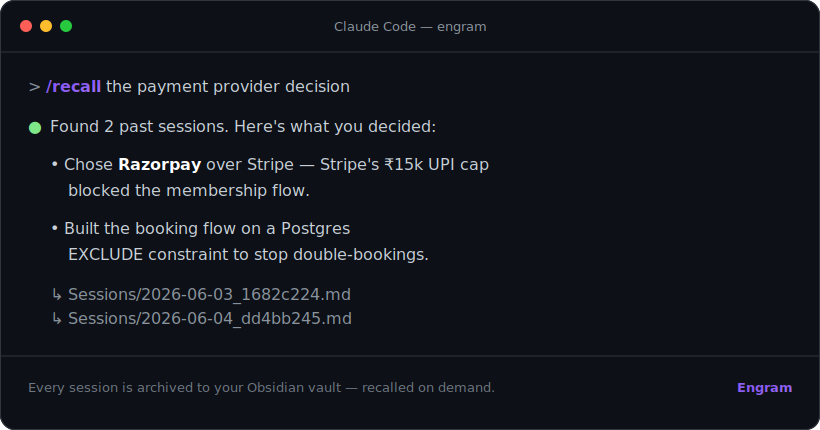
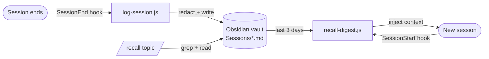

<div align="center">


# Engram

### Persistent memory for Claude Code — saved to your Obsidian vault.

Every session **auto-archived**. Recent work **auto-recalled** at startup. Your whole history **searchable** with `/recall`.
Cross-platform · zero-config · zero-dependency · MIT.

[](LICENSE)
[](package.json)
[](#install)
[](#contributing)
[](https://github.com/nandukmelath/engram/stargazers)

<br/>



</div>

---

## The problem

Claude Code forgets everything the moment a session ends. Worse — it **deletes raw transcripts after 30 days**. All that context, every decision, every fix: gone.

**Engram fixes that.** It writes every session to a folder of plain Markdown — i.e. an [Obsidian](https://obsidian.md) vault — then feeds the recent stuff back into each new session and lets you search the rest. Your AI pair-programmer finally has a long-term memory, and *you own the file*.

```
~/claude-code-memory/                 ← open this as an Obsidian vault
├── Sessions/
│   ├── 2026-06-03_1682c224.md        ← full transcript, one note per session
│   └── 2026-06-05_9b2c2058.md
├── Sessions/Daily/
│   └── 2026-06-05.md                 ← date index, linked
└── Memory/                           ← Claude's curated long-term facts
    └── MEMORY.md
```

---

## Install

### Option A — Claude Code plugin  *(recommended, 10 seconds)*

In Claude Code:

```
/plugin marketplace add nandukmelath/engram
/plugin install engram@engram
```

Restart Claude Code. That's it — every session from now on is archived, and recent work is recalled at startup.

### Option B — npm  *(standalone / power features)*

```bash
npx engram init        # wire hooks + /recall, create the vault
npx engram backfill    # import ALL your existing sessions
```

Then **open the vault folder in Obsidian** → *Open folder as vault* → pick `~/claude-code-memory`.

> Want it somewhere else? `npx engram init --vault "~/Documents/My Vault"` or set `ENGRAM_VAULT`.

---

## What you get

| Feature | What it does |
| --- | --- |
| 📓 **Auto-archive** | A `SessionEnd` hook writes every session to `Sessions/` as Markdown (your prompts, Claude's replies, tool calls) + a daily index. |
| 🧠 **Auto-recall** | A `SessionStart` hook injects the last 3 days of work into each new session, so Claude picks up where you left off. |
| 🔎 **`/recall <topic>`** | Search your entire history mid-session: *"what did we decide about auth?"* → it greps the vault and answers with citations. |
| 🔒 **Secret redaction** | API keys, tokens, passwords, JWTs and private keys are scrubbed to `[REDACTED]` **before** anything touches disk. |
| 🌐 **Global memory** *(opt-in)* | `engram init --global-memory` points Claude Code's native memory at the vault so the *same* memory loads from every project folder. |
| 📦 **Yours forever** | Plain Markdown. No database, no cloud, no lock-in. Survives the 30-day transcript purge. |

---

## How it works



Two tiny Node scripts, wired as Claude Code [hooks](https://docs.anthropic.com/claude-code). No daemon, no dependencies, no network. They **silent-fail** — a hiccup never blocks your session.

---

## `/recall` in action

```
You:  /recall the razorpay integration
Claude: Found 2 sessions. On 2026-06-03 you chose Razorpay over Stripe
        (₹15k UPI cap) and built the EXCLUDE-constraint booking flow…
        ↳ Sessions/2026-06-03_1682c224.md
        ↳ Sessions/2026-06-04_dd4bb245.md
```

---

## Configuration

| Knob | Default | How |
| --- | --- | --- |
| Vault location | `~/claude-code-memory` | `ENGRAM_VAULT` env, `--vault <path>`, or `~/.config/engram/config.json` |
| Claude config dir | `~/.claude` | honors `CLAUDE_CONFIG_DIR` |
| Recall digest size | last 3 days, ~1800 chars | edit `hooks/recall-digest.js` |

---

## Privacy & safety

- **Local only.** Nothing leaves your machine. The vault is just files.
- **Redaction.** Common secret formats (`sk-…`, `AKIA…`, `ghp_…`, `AIza…`, JWTs, `-----BEGIN … KEY-----`, `password:`/`token:` pairs) are replaced with `[REDACTED]` at write time. Redaction is best-effort — review before sharing a vault.
- **Skips noise.** Trivial sessions (a one-liner with no tool calls) aren't archived.

---

## FAQ

**Do I need Obsidian?** No. Engram writes plain Markdown — Obsidian just makes it a beautiful, linked, searchable graph. Any editor works.

**Does this slow Claude Code down?** No. Archiving runs *after* a session ends; the startup digest is a sub-second read.

**Will it bloat my context?** The digest is capped (~1800 chars) and clearly labelled as reference. Disable it anytime via `/hooks`.

**Other agents (Cursor, Codex…)?** The npm install is agent-agnostic for anything that can call a command hook; the plugin is Claude Code-specific.

**Uninstall?** `npx engram uninstall` (or `/plugin uninstall engram@engram`). Your vault is never touched.

---

## Star history

<a href="https://star-history.com/#nandukmelath/engram&Date">
  
</a>

## Contributing

Issues and PRs welcome — redaction patterns, transcript edge-cases, new agents, nicer notes. If Engram saved you a "wait, what did we do last week?", **drop a ⭐ — it's how others find it.**

## License

[MIT](LICENSE) © Nandu
